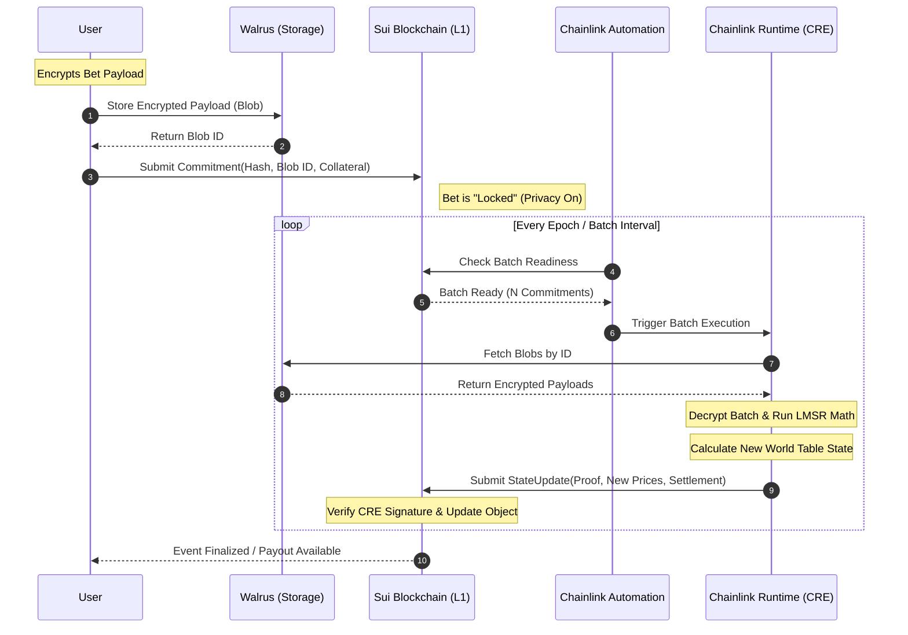
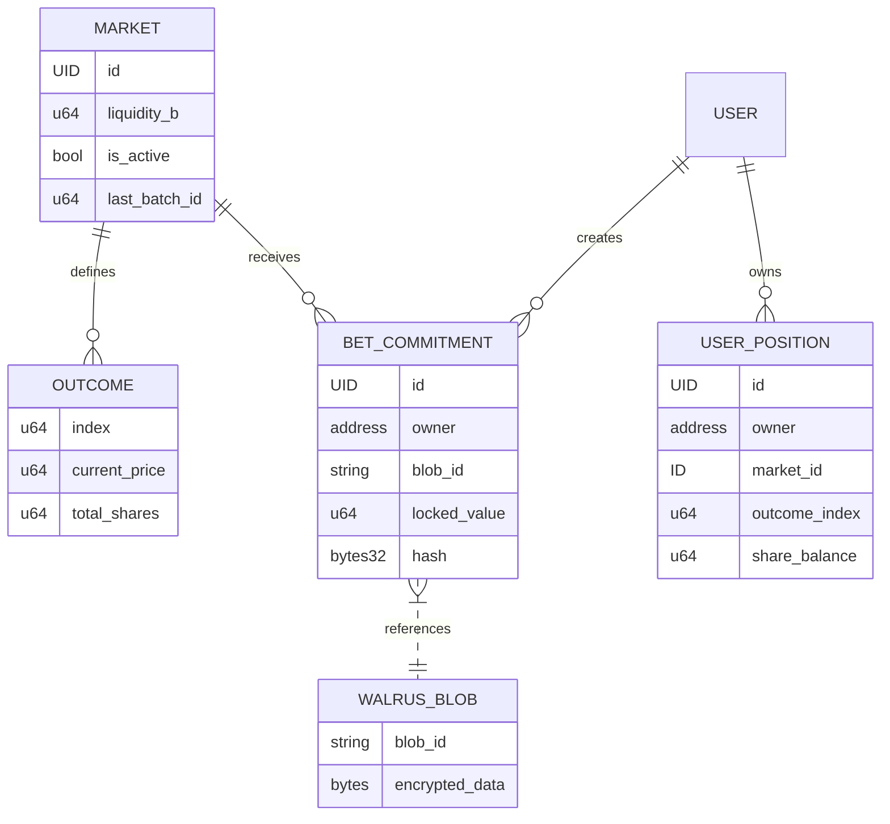

# Software Requirements Specification (SRS) for BanhMiCast

**Project:** BanhMiCast – Next-Gen Prediction Market  
**Version:** 1.0-DRAFT  
**Status:** High-Level Architecture & Requirements  
**Framework:** Sui Blockchain (Move) + Chainlink Runtime Environment (CRE)

---

## 1. Introduction

### 1.1 Purpose
This document specifies the functional and non-functional requirements for **BanhMiCast**, a decentralized prediction market. BanhMiCast utilizes a **Joint-Outcome AMM (World Table)** model to solve liquidity fragmentation and leverages **Chainlink Runtime Environment (CRE)** for encrypted batching and $0-cost off-chain computation.

### 1.2 Scope
BanhMiCast provides a platform for users to trade on the outcome of future events. Unlike traditional prediction markets, BanhMiCast uses the "World Table" approach to unify liquidity across different event outcomes and utilizes Sui’s object-centric model for high-concurrency settlement.

### 1.3 Definitions, Acronyms, and Abbreviations
*   **AMM:** Automated Market Maker.
*   **CRE:** Chainlink Runtime Environment.
*   **DON:** Decentralized Oracle Network.
*   **Joint-Outcome AMM (World Table):** A liquidity model where multiple markets share a unified liquidity pool.
*   **Encrypted Batching:** A process where user bets are encrypted and batched off-chain to prevent MEV and front-running.
*   **Move:** The programming language used by the Sui blockchain.

---

## 2. Overall Description

### 2.1 Product Perspective
BanhMiCast is a decentralized application (dApp) consisting of:
1.  **On-chain Logic (Sui/Move):** Handles asset custody, market state, and final settlement.
2.  **Off-chain Compute (Chainlink CRE):** Handles the "World Table" AMM math (LMSR/CPMM variations), batching of orders, and outcome verification.
3.  **Frontend:** A React/Sui-wallet integrated interface.

### 2.2 User Classes and Characteristics
*   **Users (Bettors):** Individuals seeking to hedge risks or speculate on event outcomes.
*   **Admin/Market Creators:** Entities responsible for initializing markets and providing initial liquidity.
*   **Chainlink DON (The Engine):** The decentralized network executing the CRE code and providing oracle data.

### 2.3 Design and Implementation Constraints
*   **Sui Object Model:** All markets must be represented as unique programmable objects to maximize parallel execution.
*   **CRE Serverless:** Computation must be stateless within the CRE to maintain $0-cost infrastructure goals.

---

## 3. System Features & Functional Requirements

### 3.1 Market Creation & Management
*   **FR-1.1:** The system shall allow authorized actors to create prediction markets by defining: Event ID, Outcome Space, Expiry Timestamp, and Initial Liquidity.
*   **FR-1.2:** The system shall initialize a "World Table" state for each market group to ensure cross-outcome liquidity efficiency.

### 3.2 Secure Betting (Encrypted Payload)
*   **FR-2.1:** The system shall provide a client-side encryption module to wrap user bets (outcome choice + amount) before submission.
*   **FR-2.2:** The system shall accept encrypted payloads to prevent front-running and "copy-trading" by observers or validators.

### 3.3 Decentralized Batching & AMM Execution (CRE)
*   **FR-3.1:** The Chainlink DON shall collect encrypted bets over a specific epoch (e.g., 2 seconds).
*   **FR-3.2:** The CRE shall decrypt the batch and calculate the new price based on the Joint-Outcome AMM formula (e.g., Logarithmic Market Scoring Rule - LMSR).
*   **FR-3.3:** The CRE shall generate a single "State Update" proof to be submitted to the Sui blockchain, minimizing gas costs.

### 3.4 Automated Settlement & Payout
*   **FR-4.1:** Upon event expiry, the Chainlink DON shall fetch the verifiable outcome from external data providers.
*   **FR-4.2:** The system shall automatically trigger the "Settlement" function in the Move contract to distribute Sui-based assets (SUI/USDC) to winners.

---

## 4. Non-Functional Requirements

### 4.1 Privacy & Security
*   **NFR-1 (Privacy):** User intent must remain hidden until the batch is finalized in the CRE to mitigate MEV (Maximal Extractable Value).
*   **NFR-2 (Integrity):** All computations performed in the CRE must be verifiable via cryptographic signatures from the DON nodes.

### 4.2 Scalability & Performance
*   **NFR-3 (Throughput):** The system shall handle at least 1,000 transactions per second (TPS) via off-chain batching before committing a single transaction to Sui.
*   **NFR-4 (Latency):** The end-to-end execution from bet submission to on-chain confirmation should not exceed 5 seconds.

### 4.3 Cost Efficiency
*   **NFR-5 ($0-Cost Infrastructure):** The system must utilize Chainlink's serverless CRE architecture to avoid the costs of maintaining dedicated backend servers (EC2/GCP).
*   **NFR-6 (Gas Optimization):** By batching transactions, the cost per bet for the user should be reduced by $>90\%$ compared to direct on-chain interaction.

---

## 5. Use Case Diagram

The following diagram illustrates the interaction between the User, the Admin, and the Chainlink CRE nodes within the Sui ecosystem.

```mermaid
usecaseDiagram
    actor "User (Bettor)" as User
    actor "Admin (Market Maker)" as Admin
    actor "Chainlink DON (CRE)" as CRE
    
    package "BanhMiCast System" {
        usecase "Create Market & Provide Liquidity" as UC1
        usecase "Submit Encrypted Bet" as UC2
        usecase "Batch & Execute AMM Math" as UC3
        usecase "Verify Outcome & Settle" as UC4
        usecase "Withdraw Winnings" as UC5
    }

    Admin --> UC1
    User --> UC2
    User --> UC5
    
    UC2 --> CRE : "Encrypted Payload"
    CRE --> UC3 : "Joint-Outcome Math"
    CRE --> UC4 : "Oracle Data Trigger"
    
    UC3 --|> "Sui Blockchain" : "State Update"
    UC4 --|> "Sui Blockchain" : "Payout Distribution"
```

---

## 6. Technical Notes (The "Guru" Perspective)

1.  **On the Joint-Outcome AMM:** By using a World Table, we ensure that a bet *against* "Team A" is mathematically treated as a bet *for* the rest of the pool, preventing the liquidity fragmentation seen in PolyMarket-style binary pairs.
2.  **On Encrypted Batching:** We are implementing a **Threshold Decryption** scheme. No single CRE node can see the user's bet until the batch is closed, ensuring a fair-ordering sequence.
3.  **On Sui Move:** We leverage **Programmable Transaction Blocks (PTB)** to allow users to swap, bet, and stake in a single atomic transaction, significantly enhancing the UX.

---

# Software Architecture Document (SAD): BanhMiCast
**Architecture Model:** 4+1 View Framework  
**Stakeholders:** Engineering Team, Security Auditors, Chainlink Node Operators, Sui Validators.

---

## 1. Architectural Representation (The Hybrid Thesis)
BanhMiCast utilizes a **Hybrid Compute Model**. We offload computationally expensive LMSR (Logarithmic Market Scoring Rule) math to **Chainlink CRE** while maintaining the source of truth on **Sui**. By utilizing **Walrus** for decentralized storage of encrypted payloads, we ensure data availability without bloating the L1 state.

---

## 2. Logical View (Functional Abstraction)
The system is divided into three primary layers:
1.  **State Layer (Sui):** Manages the `WorldTable` object, ownership of assets, and finality of bets.
2.  **Execution Layer (Chainlink CRE):** A serverless, decentralized environment that runs the LMSR pricing engine and batching logic.
3.  **Storage Layer (Walrus):** Stores the encrypted transaction metadata (blobs) to keep the L1 "thin."

---

## 3. Process View (Data Flow & Security Architecture)

### 3.1 Anti-Front-Running & Anti-Copy-Trading
Traditional prediction markets suffer from **MEV (Maximal Extractable Value)** and **Copy-Trading** (where bots mirror high-alpha traders). BanhMiCast mitigates this via **Encrypted Batching**:
*   **Encrypted Payload:** Users encrypt their bet (Outcome Index + Amount) using the public key of the Chainlink DON.
*   **Commitment Phase:** The user submits a `Commitment Hash` and a `Walrus Blob ID` to Sui. At this stage, neither the validator nor the public knows the bet's direction.
*   **Execution Phase:** CRE fetches the batch, decrypts it internally (using Threshold Decryption or a secure enclave context), and executes the LMSR math in a single atomic "World Table" update.

### 3.2 Sequence Diagram: The Life of a Bet
This diagram illustrates the interaction between the User, Sui, Walrus, and the Chainlink CRE.



---

## 4. Development View (Component Decomposition)

### 4.1 Sui Move Modules
*   **`market.move`**: Defines the `WorldTable` shared object.
*   **`escrow.move`**: Handles collateral locking and automated payouts.
*   **`verifier.move`**: Validates the cryptographic signatures/proofs sent by the Chainlink DON.

### 4.2 CRE Engine (Off-chain)
*   **Batching Engine**: Aggregates `Blob IDs` from the Sui Event stream.
*   **Pricing Core**: Implements the Joint-Outcome LMSR formula to ensure liquidity is never fragmented.
*   **Oracle Connector**: Fetches real-world data to resolve markets upon expiry.

---

## 5. Physical View (Infrastructure Mapping)
*   **Sui Network:** Globally distributed validators providing <1s finality for commitments.
*   **Chainlink DON (Decentralized Oracle Network):** Multiple independent nodes running the CRE to ensure no single point of failure in decryption or computation.
*   **Walrus Nodes:** A decentralized storage network providing high data availability for the encrypted payloads.

---

## 6. +1 View (Scenarios)

### Scenario: The High-Vol Event (e.g., Election Day)
*   **Challenge:** Thousands of users betting simultaneously, causing gas spikes and front-running.
*   **BanhMiCast Solution:** 
    1.  Users submit small commitment transactions to Sui (low gas).
    2.  Large volumes of data are stored on Walrus ($0-cost infrastructure for BanhMiCast).
    3.  CRE processes 500 bets in a single "State Update" transaction to Sui.
    4.  **Result:** Gas efficiency improves by 500x, and no bot can front-run individual bets because they are encrypted.

---

## 7. Security & Guru Insights

1.  **Stateless Execution:** The CRE must remain functionally stateless. Every transition from `State N` to `State N+1` must be accompanied by a verifiable proof that the LMSR math was applied correctly to the specific batch of Commitment Hashes recorded on Sui.
2.  **Liveness Risk:** If the Chainlink DON fails to trigger, the Sui contract includes a "Grace Period" mechanism. If no update occurs within X hours, users can trigger a "Force Revert" to reclaim their collateral.
3.  **World Table Scalability:** By representing the market as a Sui **Object**, we avoid global state contention, allowing multiple markets to be processed in parallel across different CRE instances.

---

# Software Design Document (SDD): BanhMiCast
**Framework:** Sui Move (Object-Oriented) & Chainlink CRE (JavaScript/Serverless)  
**Author:** Principal Systems Engineer & Data Modeler Master

---

## 1. Data Model & Schema Definition

In a Move-based ecosystem, we treat data as first-class citizens (Objects). We decouple the **Market State** from the **User Intent** to allow for high-concurrency batching.

### 1.1 Sui On-chain Objects (Move Structs)

#### A. MarketObject (Shared Object)
The "World Table" source of truth.
```rust
struct MarketObject has key {
    id: UID,
    creator: address,
    description_cid: String,      // IPFS/Walrus link to metadata
    outcomes_count: u64,
    liquidity_b: u64,             // The 'b' parameter in LMSR (Sensitivity)
    shares_supply: Table<u64, u64>, // Outcome_Index -> Total_Shares_Issued
    current_prices: vector<u64>,  // Cached prices from the last batch
    is_active: bool,
    collateral_vault: Balance<SUI>,
    last_batch_id: u64,
}
```

#### B. BetCommitment (Owned Object)
Created when a user places a bet. It acts as an escrowed intent.
```rust
struct BetCommitment has key {
    id: UID,
    owner: address,
    market_id: ID,
    encrypted_payload_cid: String, // Pointer to Walrus Blob
    commitment_hash: vector<u8>,   // SHA3-256 of the plain text for verification
    collateral_locked: Balance<SUI>,
    epoch_locked: u64,
}
```

### 1.2 CRE JSON Interaction Schema
The communication bridge between the off-chain execution engine (CRE) and the Sui Move contract.

#### A. Input Payload (To CRE)
```json
{
  "market_id": "0xABC...123",
  "current_state": { "liquidity_b": 1000, "shares_supply": [5000, 3200, 4100] },
  "batch": [
    { "user": "0xUserA", "blob_id": "W-123", "commitment": "0xHASH1" },
    { "user": "0xUserB", "blob_id": "W-456", "commitment": "0xHASH2" }
  ]
}
```

#### B. Execution Result (From CRE to Sui)
```json
{
  "market_id": "0xABC...123",
  "batch_id": 99,
  "new_shares_supply": [5500, 3100, 4600],
  "price_updates": [0.45, 0.25, 0.30],
  "payout_adjustments": [
    { "user": "0xUserA", "shares_minted": 150, "outcome_index": 0 },
    { "user": "0xUserB", "shares_minted": 80, "outcome_index": 2 }
  ],
  "proof": "0xDON_SIG_HEX"
}
```

---

## 2. Module Decomposition

### 2.1 The "Truth Layer" (Sui Move Modules)
**Responsibility:** Finality, Escrow, and Cryptographic Verification.
*   **Asset Management:** Manages `collateral_vault`. Only releases funds if the CRE provides a valid, signed state update.
*   **Commitment Ledger:** Records user bets without knowing the contents. This ensures users cannot change their minds after seeing the price move.
*   **State Verifier:** Validates the `DON_SIG` against the known public keys of the Chainlink Oracle nodes.

### 2.2 The "Compute & Privacy Layer" (Chainlink CRE Script)
**Responsibility:** Data Retrieval, Decryption, and Heavy Math.
*   **Encrypted Decryptor:** Fetches payloads from Walrus. Internally decrypts using the DON's private key share (Threshold Encryption).
*   **LMSR Engine:** Calculates the cost function $C(q) = b \ln(\sum e^{q_i/b})$.
    *   Determines how many shares a user gets based on the spot price at the moment of batch execution.
    *   Maintains the "World Table" logic (Total probability sums to 1).
*   **Batch Aggregator:** Collates hundreds of individual bets into a single cryptographic proof to save 99% in gas fees.

---

## 3. Entity Relationship Diagram (ERD)



---

## 4. Technical Logic Flows

### 4.1 Off-chain Math: `executeBatch` (JavaScript)
```javascript
async function executeBatch(marketState, orders) {
    let b = marketState.liquidity_b;
    let q = [...marketState.shares_supply]; // current shares per outcome

    let adjustments = [];

    for (let order of orders) {
        let { outcomeIndex, investmentAmount } = decrypt(order.blob);
        
        // LMSR Math: Calculate delta_q
        // Cost(q + delta_q) - Cost(q) = investmentAmount
        let delta_q = solveLMSR(q, outcomeIndex, investmentAmount, b);
        
        q[outcomeIndex] += delta_q;
        adjustments.push({ user: order.user, minted: delta_q, index: outcomeIndex });
    }

    // New Prices: P_i = exp(q_i/b) / sum(exp(q_j/b))
    let newPrices = calculatePrices(q, b);

    return { q, newPrices, adjustments };
}
```

### 4.2 Security Boundary
1.  **Isolation:** The `decrypt()` function only operates within the CRE's protected memory. The Sui Validators never see the raw `outcomeIndex` until the batch is finalized.
2.  **Atomicity:** The `MarketObject` on Sui is only updated if all `BET_COMMITMENT` IDs in the batch match the hashes stored on-chain. If one hash is mismatched, the entire batch is rejected.

---
**Summary for Lead BA:** This design ensures that BanhMiCast remains **hyper-scalable** by moving the $O(n)$ math off-chain and **MEV-resistant** by keeping intents encrypted until they are batched.

---

# Technical Design Document (TDD): BanhMiCast Hybrid Integration
**Architecture:** Off-chain Encrypted Batching via Chainlink CRE + On-chain Verification via Sui Move.  
**Version:** 1.0 (Production Grade)  
**Security Level:** High (Threshold Decryption & DON-signed State Updates)

---

## 1. On-chain Module: `banhmicast::market`

### 1.1 Function: `commit_bet`
Users initiate their intent without revealing the direction of the bet.
*   **Params:**
    *   `market: &mut MarketObject`: The target prediction market.
    *   `payment: Coin<SUI>`: The investment amount.
    *   `blob_id: String`: The ID of the encrypted payload stored on Walrus.
    *   `commitment_hash: vector<u8>`: `sha3_256(plain_bet_details)`.
*   **Returns:** `BetCommitment` (Owned Object).
*   **Asserts/Requires:**
    *   `assert!(market.is_active, E_MARKET_CLOSED)`
    *   `assert!(coin::value(&payment) >= MIN_BET, E_INSUFFICIENT_FUNDS)`
    *   `assert!(vector::length(&commitment_hash) == 32, E_INVALID_HASH)`
*   **Gas Note:** This is a O(1) storage operation. Minimal gas usage.

### 1.2 Function: `resolve_batch_with_cre`
The primary entry point for the Chainlink DON to update the market state.
*   **Params:**
    *   `market: &mut MarketObject`: The shared market state.
    *   `batch_data: BatchUpdatePayload`: Contains `new_shares_supply`, `price_vec`, and `user_allocations`.
    *   `signature: vector<u8>`: The aggregated Threshold Signature from the DON.
    *   `bet_ids: vector<ID>`: List of `BetCommitment` objects being processed.
*   **Returns:** `void` (Emits `BatchResolvedEvent`).
*   **Logic:**
    1.  **Identity Verification:** Check if `signature` is valid against the stored `DON_PUBLIC_KEY`.
    2.  **Atomicity Check:** Verify that the number of `bet_ids` matches the `batch_data.allocation_count`.
    3.  **State Update:** Update `market.shares_supply` and `market.current_prices`.
    4.  **Distribution:** Convert `BetCommitment` objects into `UserPosition` (Shares) objects based on the computed LMSR price.
*   **Asserts:**
    *   `assert!(verify_don_signature(batch_data, signature), E_INVALID_PROOF)`
    *   `assert!(market.last_batch_id + 1 == batch_data.batch_id, E_OUT_OF_SEQUENCE)`

---

## 2. Off-chain Module: Chainlink CRE (JavaScript Execution)

### 2.1 Function: `calculateLMSRCost`
Implements the core Logarithmic Market Scoring Rule logic to determine price shifts.
*   **Logic:**
    *   $C(q) = b \cdot \ln(\sum_{j=1}^{N} e^{q_j/b})$
    *   `cost = calculateLMSRCost(new_q) - calculateLMSRCost(old_q)`
*   **Implementation:** Uses high-precision BigInt math to avoid floating point discrepancies between CRE nodes.

### 2.2 Function: `executeBatch`
*   **Input:** Array of `EncryptedOrders`, current `MarketState`.
*   **Process:**
    1.  **Threshold Decryption:** CRE nodes collaborate to decrypt the `blob_id` contents. No single node can see the data.
    2.  **Sequential Processing:** Sort orders by `CommitmentHash` (deterministic ordering) to prevent node-level bias.
    3.  **LMSR Calculation:** For each order, calculate how many shares are minted given the increasing price curve.
    4.  **Aggregated Proof:** Generate a Merkle Root of the state change.

---

## 3. Cryptographic & Security Architecture

### 3.1 Threshold Decryption Mechanism
To eliminate **Front-Running** and **Copy-Trading**:
1.  Users encrypt their `OutcomeIndex` using the **DON Public Key** ($PK_{don}$).
2.  The private key ($SK_{don}$) is split into $n$ shards using Shamir’s Secret Sharing.
3.  A threshold $k$ (e.g., $2/3$ of nodes) must provide a partial decryption share for the batch to be revealed inside the CRE.
4.  **Result:** The bet remains "Dark" (private) on Sui until the price is already locked in the batch.

### 3.2 Security Guardrails (The "Guru" Check)
*   **Slippage Guard:** The `resolve_batch_with_cre` function includes a `max_price_impact` parameter. If the off-chain calculation results in a price shift > X% for a single batch, the transaction reverts to protect users from thin liquidity manipulation.
*   **Linearizability:** By including `last_batch_id` in the on-chain state, we prevent "Replay Attacks" where a DON might try to submit the same profitable batch twice.

---

## 4. Error Handling & Edge Cases

| Edge Case | Impact | Resolution Mechanism |
| :--- | :--- | :--- |
| **CRE Liveness Failure** | Batch not processed | **Timeout Recovery:** If no batch is posted for 30 mins, users can call `emergency_refund()` to reclaim their `BetCommitment` collateral. |
| **Signature Mismatch** | Transaction Reverts | **Slashing/Reputation:** Chainlink Automation will retry with a different node subset. Consistent failure triggers a DON node audit. |
| **Insufficient Liquidity** | Price hits infinity | **LMSR Bound:** The `b` parameter (liquidity) is fixed at market creation. The contract prevents bets that exceed 90% of the mathematical limit. |
| **Gas Spike on Sui** | Delay in update | **Encrypted Queue:** Since bets are already committed and hashed, the delay doesn't allow front-running; it only delays the minting of share objects. |

---

## 5. Gas Optimization Strategy (Sui Micro-level)

1.  **Object Wrapping:** Instead of creating a new `Object` for every bet, the `resolve_batch_with_cre` function **destroys** the `BetCommitment` and returns the storage rebate to the user/caller, significantly lowering net transaction costs.
2.  **Vector Compression:** We pass `price_updates` as a `vector<u64>` (scaled integers) rather than decimals to minimize Move bytecode execution time.
3.  **PTB Atomicity:** We utilize Sui **Programmable Transaction Blocks** to allow the DON to:
    *   Fetch all `BetCommitment` objects.
    *   Call `resolve_batch_with_cre`.
    *   Emit events.
    *   All in one single Gas-efficient execution.

---

# BanhMiCast UX Framework: The "Invisible Complexity" Strategy

## 1. Five Core UX Principles

### I. Transparency in Privacy (The "Black Box" Trust)
*   **The Problem:** Encrypted batching creates a period where the user's bet is "invisible." This can cause anxiety.
*   **The Principle:** We must explain *why* it is hidden. Instead of a generic loading spinner, use copy like: *"Securing your bet against front-running bots..."* or *"Encrypting your intent for fair-market pricing."*
*   **Implementation:** Visual "Lock" icon on the pending transaction that unlocks only when the CRE batch is finalized.

### II. Unified Probability Visualization (The World Table)
*   **The Problem:** Multi-outcome markets (World Table) are mathematically superior but visually overwhelming compared to Yes/No pairs.
*   **The Principle:** Use "Relative Weight" visuals. Instead of just numbers, use an interactive **Dynamic Probability Map** where clicking one outcome visually pushes the others away, reflecting the Joint-Outcome AMM math.
*   **Implementation:** Heatmaps or Donut charts that shift in real-time as users adjust their bet size.

### III. Instant Gratification through Commitments
*   **The Problem:** The batching delay (CRE processing) kills the "Dopamine Hit" of a successful trade.
*   **The Principle:** Separate the **Action** from the **Settlement**. The moment a user clicks "Bet," the Sui blockchain records the *Commitment*.
*   **Implementation:** Give the user a **"Digital Ticket Stub"** immediately upon commitment. The ticket stays in a "Pending Reveal" state, making the wait feel like an "Event" rather than a "Lag."

### IV. Slippage-Aware Intent (Fairness by Design)
*   **The Problem:** In a batch of 1,000 orders, the user's final execution price might differ from the spot price they saw.
*   **The Principle:** Move from "Market Orders" to "Guaranteed Outcomes."
*   **Implementation:** Let users set a **"Minimum Shares Guaranteed"** toggle. If the CRE math results in fewer shares than the user’s limit due to batch slippage, the transaction auto-reverts (Safe-fail).

### V. Zero-Gas Perceived Experience
*   **The Problem:** Gas fees (even on Sui) are a friction point for high-frequency prediction traders.
*   **The Principle:** Abstract the gas. Since CRE is $0-cost infrastructure, BanhMiCast should use Sui’s **Sponsored Transactions**.
*   **Implementation:** The UI should say *"Transaction Fee: $0 (Sponsored by BanhMiCast)"* to lower the psychological barrier to entry.

---

## 2. User Journey: The "Informed Trader"

The Informed Trader focuses on data accuracy, hedge efficiency, and execution speed.

| Phase | User Action | System Response | UX Secret Sauce |
| :--- | :--- | :--- | :--- |
| **1. Analysis** | Explores the "World Table" outcomes. | Real-time LMSR price updates via WebSocket. | **Interactive Sliders:** See how a 100 SUI bet moves the entire market. |
| **2. Intent** | Enters bet amount & outcome choice. | CRE calculates "Expected Shares." | **"Anti-Front-Run" Badge:** Confirming the bet will be encrypted. |
| **3. Commitment** | Clicks "Place Secure Bet" (Sign with Wallet). | **Sui L1 Finality (<1s).** Commitment hash stored. | **The "Ticket" Animation:** A physical-looking ticket appears in the UI. |
| **4. The Interval** | Waits for Batch Execution (2-5 seconds). | CRE aggregates, decrypts, and runs math. | **Progressive "Batch Meter":** Visualizing the batch filling up. |
| **5. The Reveal** | System updates automatically. | CRE proof submitted to Sui; Shares minted. | **Success Sound & Haptic:** A satisfying "Click" when the ticket "Unlocks." |
| **6. Settlement** | Event resolves. | Auto-payout trigger via CRE/Oracle. | **One-Click Claim:** Funds sent directly to the Sui Wallet. |

---

## 3. Handling "Pending States" (The CRE Interval)

The 2-5 second delay between *Commitment* and *Execution* is the "Danger Zone" where users drop off. We turn this from a technical limitation into a feature.

### A. The "Batch Pulse" Animation
Instead of a static loading bar, use a pulse animation that beats faster as the batch reaches capacity. 
*   **Copy:** *"Gathering 45 other traders for this batch... Finalizing prices."* 
*   **Psychology:** This creates a sense of "Social Trading" and "Collective Liquidity."

### B. The "Verifiable Receipt" Sidecar
While the batch is pending, provide a sidecar panel that shows the **Commitment Hash** and the **Encrypted Payload ID** (on Walrus). 
*   **UX Goal:** Educate the user that their data is safe and immutable even before the math is done. It builds the "Guru" brand.

### C. Predictive State Updates (Optimistic UI)
Show a "Shadow Position" in the user’s portfolio.
*   **Visual:** The shares appear in the portfolio immediately but are **"Greyed Out"** or **"Translucent"** with a "Minting..." label. 
*   **Psychology:** It gives the user an immediate sense of ownership.

---

## 4. Final UX Quote for the Team
> *"In BanhMiCast, we don't just sell predictions; we sell **Verifiable Fairness**. If the user has to worry about the math, we’ve failed. If the user feels the 'power' of the World Table through a simple slider, we’ve won."*

---

# UI Design System: "Obsidian Crust"

## 1. Visual Foundation

### 1.1 Color Palette (The Cyber-Culinary Contrast)
We use a "Deep Dark" base to minimize eye strain during high-volatility sessions, accented with high-vibrancy "Sui-Cians" and "BanhMi Gold."

*   **Primary (Brand):** `BanhMi Gold (#F2A65A)` — Used for CTAs and highlights. Represents the "golden crust" and value.
*   **Secondary (Tech):** `Sui Cyan (#4CA2FF)` — Used for technical indicators, CRE status, and blockchain-related elements.
*   **Success/Long:** `Hyper-Lime (#B4FF39)` — High-vibrancy green for profit/upward probability.
*   **Danger/Short:** `Electric-Rose (#FF3B6B)` — Sharp pinkish-red for risk/downward probability.
*   **Backgrounds:** `Obsidian (#0A0B0D)` (Base), `Charcoal (#14161A)` (Cards), `Steel (#24272E)` (Borders).

### 1.2 Typography (The Technical Sans)
We need fonts that look like code but read like finance.
*   **Headings:** `Mona Sans` — A powerful, wide-spaced sans-serif for a modern, bold look.
*   **Data/Numbers:** `Geist Mono` — For the "World Table" and price feeds. Monospaced numbers prevent "jumping" UI when values update rapidly.
*   **Body:** `Inter` — The industry standard for readability in dense DeFi interfaces.

### 1.3 Layout System (The "Modular Grid")
*   **Bento-Box Grid:** Every element (Orderbook, Chart, World Table) is a modular card with a `1px` border (`Steel`).
*   **Spatial Depth:** Use inner-glows instead of drop shadows to simulate a "Control Center" embedded in glass.

---

## 2. Data Visualization: The World Table (Joint-Outcome Matrix)

Visualizing $2^N$ outcomes (where outcomes of different events are linked) requires **nested hierarchies** to prevent cognitive overload.

### 2.1 The "Ribbon of Probability"
Instead of a flat list, use a **Weighted Horizontal Stack**. 
*   **Logic:** Every event outcome is a block in the stack. The width of the block represents its probability (0-100%).
*   **Joint Visualization:** When a user selects a combination (e.g., "Team A wins" + "Gas < 20 gwei"), the UI highlights the **Intersection** of these ribbons, dimming the rest.

### 2.2 The "Probability Heat-Grid"
For the World Table matrix:
*   **Cell Intensity:** Use background opacity based on probability. High-probability cells glow with `BanhMi Gold` at 20% opacity.
*   **Delta Indicators:** Small, floating `+` or `-` indicators next to prices that fade in/out when the CRE updates a batch, showing "Pressure" in the market.

---

## 3. Component States & Web3 Wallet Interactions

In BanhMiCast, the "Sign" action is unique because it initiates an **Encrypted Commitment**.

### 3.1 Button & Wallet Sign States
| State | Visual Treatment | Meaning |
| :--- | :--- | :--- |
| **Default** | `Gold` background, black text. High contrast. | Ready to trade. |
| **Hover** | `Gold` glow effect (box-shadow: 0 0 15px #F2A65A). | Action intent confirmed. |
| **Active (Click)** | Scaled down to 98%, background shifts to `Sui Cyan`. | Wallet handshake initiated. |
| **Wallet Signing** | Pulsing border. Text changes to *"Check Wallet..."* | Awaiting L1 commitment. |
| **Processing (CRE)** | Shimmer effect (Skeleton loading) across the card. | Off-chain batching in progress. |
| **Disabled** | 40% Opacity, `Grayscale` filter. | Insufficient balance or Market Closed. |

### 3.2 The "Encryption Shield" Animation
When a user signs, a **Shield Icon Overlay** briefly appears over the "Place Bet" button.
*   **Visual:** Hexagonal particles collapse into the button.
*   **Purpose:** To visually communicate that the payload is being **encrypted** before leaving the browser, reinforcing the "Privacy" principle.

---

## 4. UI Standards for "Trust"

1.  **Verifiable Badges:** Every price update from the CRE should have a tiny "Chainlink" logo next to it. Hovering reveals the **Batch ID** and **Proof Link**.
2.  **Slippage Tolerance Bar:** A sleek, minimal slider that changes from `Cyan` (Safe) to `Rose` (Aggressive) as the user increases their slippage tolerance.
3.  **Real-Time "Liveness" Dot:** A small green blinking dot in the header labeled "CRE Syncing," indicating the off-chain engine is healthy.

---

## 5. Summary Quote
> *"We don't just show data; we show the **certainty of the uncertain**. By using Obsidian-Dark surfaces and Gold-Light data points, we turn a prediction market into a high-precision instrument."*

---

# UX Principal System for BanhMiCast

## 1. Screen: Home / Market Explorer
**Goal:** High-level overview of available liquidity pools and active events.

### [Header]
*   **Logo:** BanhMiCast (Icon: A stylized, golden geometric baguette).
*   **Nav:** [Explore] [My Portfolio] [Leaderboard] [Docs].
*   **Network Status:** Green Dot • "CRE Node: Active" (Hover for latency details).
*   **Wallet:** [Connect Wallet] or [0x...6a81 | 120.5 SUI].

### [Hero Section]
*   **Headline:** "The Future is Parallel. Predict it with Privacy."
*   **Sub-headline:** Joint-outcome liquidity for smarter hedging. Powered by Sui & Chainlink CRE.

### [Active World Tables Grid]
*Each card represents a unified liquidity pool containing multiple linked events.*
*   **Card Title:** "Global Macro & Election Matrix" (e.g., US Election + Fed Rate Hike).
*   **Status Badge:** [High Liquidity] [Ends in 14h:20m].
*   **Mini-Probability Map:** A small 2x2 grid showing the heat of different outcome combinations.
*   **Quick Stats:** Total Volume: $1.2M | Shared Liquidity (b): 50,000.
*   **CTA Button:** [Enter Market].

---

## 2. Screen: Betting Interface (The "War Room")
**Goal:** Facilitate complex decision-making with a simple, secure execution flow.

### [Layout: Left Column - Context]
*   **Market Header:** "US Election & Interest Rate Outcome."
*   **Price Chart:** Candlestick chart showing the probability shift of the *selected* outcome combination over time.

### [Layout: Center - The World Table (Selection Matrix)]
*   **The Grid:** Columns (Event A: Win/Loss) x Rows (Event B: Up/Down).
*   **Cell Interaction:**
    *   **Inactive:** Displays "Current Price" (e.g., 0.25 SUI).
    *   **Selected:** Cell glows with a `BanhMi Gold` border. Shows "Projected Return" (e.g., 4.0x).
    *   **Tooltip:** "Betting on this outcome adds liquidity to the entire table."

### [Layout: Right Column - Betting Panel]
*   **Panel Title:** "Secure Order Entry."
*   **Asset Selector:** [SUI] [USDC].
*   **Input Field:** [ 100 ] Max.
*   **Trade Metrics (Auto-calculated via CRE preview):**
    *   **Potential Payout:** 400.00 SUI.
    *   **Price Impact:** < 0.05% (Calculated via LMSR).
    *   **Slippage Tolerance:** [0.5%] (Settings Gear icon).
*   **The Privacy Shield:** A small toggle (default ON): "Encrypted Batching Enabled" (Tooltip: Your bet is hidden from bots until the batch executes).
*   **CTA Button:**
    *   **Label:** [ ENCRYPT & SUBMIT ORDER ]
    *   **Sub-text:** "Commitment gas: ~0.001 SUI."

---

## 3. Transaction Flow & Feedback (The "Wait" UX)

Since we use **Encrypted Batching**, the user experience doesn't end at the click; it begins.

### [Step 1: Wallet Interaction]
*   **Toast (Info):** "Awaiting Signature... Please confirm the commitment in your wallet."
*   **UX Note:** The wallet only sees a hash. The UI explains: "You are signing a cryptographic commitment of your bet."

### [Step 2: Processing (The CRE Gap)]
*   **Modal Overlay (Non-intrusive):** 
    *   **Icon:** An animated shield pulsing with binary data.
    *   **Headline:** "Securing Your Bet."
    *   **Status Message:** "Your order is being batched off-chain by the Chainlink DON. This prevents front-running and ensures the best LMSR price."
    *   **Progress Bar:** [|||||||||||||||||   ] (Syncing with Batch #9928).

### [Step 3: Success Feedback]
*   **Toast (Success):** "Order Executed! Batch #9928 Finalized."
*   **Action Link:** [View Proof on SuiScan] [View Your Position].
*   **Feedback Message:** "100 SUI successfully committed. You now own 400.2 Outcome-A Shares."

---

## 4. UX Writing: Error Handling & System States

| Scenario | UX Message (Heading) | Body Text |
| :--- | :--- | :--- |
| **Slippage Exceeded** | "Price Shift Detected" | "The batch price moved beyond your 0.5% tolerance. Your collateral has been safely returned to your wallet." |
| **CRE Offline** | "Engine on Standby" | "The Chainlink CRE is currently out of sync. You can still place 'Open Commitments' or try again in a few minutes." |
| **Market Resolved** | "The Future is Here" | "This event has been resolved. You have **400 SUI** waiting for you. [Claim Now]" |

---

## 5. Micro-Copy Principles for BanhMiCast
1.  **Avoid "Bet":** Use "Invest," "Position," or "Predict" to align with the DeFi professional audience.
2.  **Explain "Encrypted":** Always pair encryption with the benefit: "Privacy-guaranteed" or "Bot-protected."
3.  **World Table Clarity:** Use "Shared Liquidity" instead of "Joint-Outcome AMM" to explain why prices are more stable.

---

# BanhMiCast Code Convention & Engineering Standards
**Status:** Mandatory for all contributors  
**Version:** 1.0  
**Scope:** Sui Move (On-chain) & Chainlink CRE (Off-chain)

---

## 1. Naming Conventions

### 1.1 Sui Move (On-chain)
Follows the official Rust/Move style guide to ensure interoperability and readability.
*   **Modules:** `snake_case` (e.g., `market_manager.move`).
*   **Functions:** `snake_case` (e.g., `calculate_payout`).
*   **Variables:** `snake_case` (e.g., `remaining_balance`).
*   **Structs:** `PascalCase` (e.g., `WorldTable`).
*   **Constants:** `SCREAMING_SNAKE_CASE` (e.g., `E_INSUFFICIENT_LIQUIDITY`).
*   **Type Parameters:** `PascalCase` (usually single letter like `T`, or descriptive like `AssetType`).

### 1.2 JavaScript / CRE (Off-chain)
Follows standard ECMAScript conventions.
*   **Variables/Functions:** `camelCase` (e.g., `executeLmsrBatch`).
*   **Classes/Interfaces:** `PascalCase` (e.g., `BatchProcessor`).
*   **Constants:** `UPPER_SNAKE_CASE` (e.g., `MAX_BATCH_SIZE`).
*   **Files:** `kebab-case.js` (e.g., `lmsr-engine.js`).

---

## 2. Documentation & Comments

### 2.1 Smart Contract NatSpec (MoveDoc)
Every public function and struct **must** be documented using `///` tags.
```rust
/// Error code for when the market is not yet resolved.
const E_MARKET_NOT_RESOLVED: u64 = 101;

/// @notice Executes the batch settlement for a specific market.
/// @dev Requires a valid signature from the Chainlink DON.
/// @param market: The shared WorldTable object.
/// @param proof: Cryptographic signature from CRE.
public entry fun resolve_batch(market: &mut MarketObject, proof: vector<u8>) {
    // ...
}
```

### 2.2 JavaScript JSDoc
All CRE logic must include JSDoc for complex mathematical functions.
```javascript
/**
 * Calculates the cost function for LMSR.
 * @param {Array<bigint>} shares - Current supply of shares per outcome.
 * @param {number} b - Liquidity sensitivity parameter.
 * @returns {bigint} The calculated cost in MIST.
 */
function calculateCost(shares, b) {
    // ...
}
```

---

## 3. Folder Structure (Monorepo)

To maintain a single source of truth for ABIs and shared types, we use a **Monorepo** structure.

```text
banhmicast/
├── packages/
│   ├── move/               # Sui Move Smart Contracts
│   │   ├── sources/        # .move files
│   │   ├── tests/          # Move Unit Tests
│   │   └── Move.toml
│   ├── cre/                # Chainlink Runtime Environment Scripts
│   │   ├── src/            # JavaScript logic
│   │   ├── tests/          # Jest/Mocha tests
│   │   └── package.json
│   └── shared/             # Shared ABIs, Type Definitions, Constants
├── docs/                   # Technical specifications & SAD
├── scripts/                # Deployment and migration scripts
└── .gitignore
```

---

## 4. Coding Best Practices & Security

### 4.1 Sui Move Specifics
*   **Explicit Errors:** Do not use generic `assert!(condition, 0)`. Use descriptive error constants starting with `E_`.
*   **Balance vs. Coin:** Use `Balance` inside Structs for storage and `Coin` for transaction arguments.
*   **Access Control:** Use the "Cap" (Capability) pattern. Admin functions must require an `&AdminCap` argument.
*   **Object Ownership:** Be explicit about `entry` functions and whether objects are passed by value (consuming them) or by reference.

### 4.2 Chainlink CRE Specifics
*   **Statelessness:** The `executeBatch` script must be deterministic. Avoid `Math.random()` or `Date.now()`. Use epoch timestamps provided by the Oracle trigger.
*   **Financial Precision:** **NEVER** use floating-point numbers (`Number`) for currency. Use `BigInt` or specialized decimal libraries to prevent rounding errors in LMSR math.
*   **Error Handling:** Use `try-catch` blocks to ensure the script returns a meaningful "Revert" reason to the DON if the batch is invalid.

---

## 5. Git Workflow & Commit Messages

### 5.1 Branching Strategy
*   `main`: Production-ready code.
*   `dev`: Integration branch for features.
*   `feature/<name>`: Individual feature development.

### 5.2 Commit Messages (Conventional Commits)
Strict adherence to [Conventional Commits](https://www.conventionalcommits.org/) is required for automated changelog generation.

*   **Format:** `<type>(<scope>): <description>`
*   **Types:**
    *   `feat`: A new feature (e.g., `feat(move): add lmsr math module`).
    *   `fix`: A bug fix (e.g., `fix(cre): handle zero liquidity edge case`).
    *   `docs`: Documentation only changes.
    *   `refactor`: Code change that neither fixes a bug nor adds a feature.
    *   `test`: Adding missing tests.

### 5.3 Pull Request Rules
1.  **Peer Review:** At least one "Approve" from a lead engineer.
2.  **CI/CD:** All `sui move test` and `npm test` must pass before merging.
3.  **Atomic Commits:** Keep PRs small. One PR = One feature/fix.

---

## 6. Auditor's Final Word
> *"Code is read much more often than it is written. Write for the auditor who will look at your code at 3 AM during a mainnet crisis. Clean code is not a luxury; it is our primary security layer."*

---

*End of Document*

