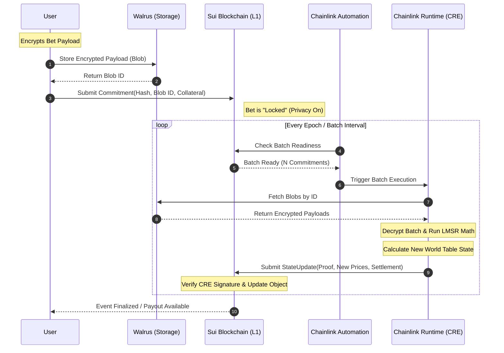

# Software Architecture Document (SAD): BanhMiCast
**Architecture Model:** 4+1 View Framework  
**Stakeholders:** Engineering Team, Security Auditors, Chainlink Node Operators, Sui Validators.

---

## 1. Architectural Representation (The Hybrid Thesis)
BanhMiCast utilizes a **Hybrid Compute Model**. We offload computationally expensive LMSR (Logarithmic Market Scoring Rule) math to **Chainlink CRE** while maintaining the source of truth on **Sui**. By utilizing **Walrus** for decentralized storage of encrypted payloads, we ensure data availability without bloating the L1 state.

---

## 2. Logical View (Functional Abstraction)
The system is divided into three primary layers:
1.  **State Layer (Sui):** Manages the `WorldTable` object, ownership of assets, and finality of bets.
2.  **Execution Layer (Chainlink CRE):** A serverless, decentralized environment that runs the LMSR pricing engine and batching logic.
3.  **Storage Layer (Walrus):** Stores the encrypted transaction metadata (blobs) to keep the L1 "thin."

---

## 3. Process View (Data Flow & Security Architecture)

### 3.1 Anti-Front-Running & Anti-Copy-Trading
Traditional prediction markets suffer from **MEV (Maximal Extractable Value)** and **Copy-Trading** (where bots mirror high-alpha traders). BanhMiCast mitigates this via **Encrypted Batching**:
*   **Encrypted Payload:** Users encrypt their bet (Outcome Index + Amount) using the public key of the Chainlink DON.
*   **Commitment Phase:** The user submits a `Commitment Hash` and a `Walrus Blob ID` to Sui. At this stage, neither the validator nor the public knows the bet's direction.
*   **Execution Phase:** CRE fetches the batch, decrypts it internally (using Threshold Decryption or a secure enclave context), and executes the LMSR math in a single atomic "World Table" update.

### 3.2 Sequence Diagram: The Life of a Bet
This diagram illustrates the interaction between the User, Sui, Walrus, and the Chainlink CRE.

---

## 4. Development View (Component Decomposition)

### 4.1 Sui Move Modules
*   **`market.move`**: Defines the `WorldTable` shared object.
*   **`escrow.move`**: Handles collateral locking and automated payouts.
*   **`verifier.move`**: Validates the cryptographic signatures/proofs sent by the Chainlink DON.

### 4.2 CRE Engine (Off-chain)
*   **Batching Engine**: Aggregates `Blob IDs` from the Sui Event stream.
*   **Pricing Core**: Implements the Joint-Outcome LMSR formula to ensure liquidity is never fragmented.
*   **Oracle Connector**: Fetches real-world data to resolve markets upon expiry.

---

## 5. Physical View (Infrastructure Mapping)
*   **Sui Network:** Globally distributed validators providing <1s finality for commitments.
*   **Chainlink DON (Decentralized Oracle Network):** Multiple independent nodes running the CRE to ensure no single point of failure in decryption or computation.
*   **Walrus Nodes:** A decentralized storage network providing high data availability for the encrypted payloads.

---

## 6. +1 View (Scenarios)

### Scenario: The High-Vol Event (e.g., Election Day)
*   **Challenge:** Thousands of users betting simultaneously, causing gas spikes and front-running.
*   **BanhMiCast Solution:** 
    1.  Users submit small commitment transactions to Sui (low gas).
    2.  Large volumes of data are stored on Walrus ($0-cost infrastructure for BanhMiCast).
    3.  CRE processes 500 bets in a single "State Update" transaction to Sui.
    4.  **Result:** Gas efficiency improves by 500x, and no bot can front-run individual bets because they are encrypted.

---

## 7. Security & Guru Insights

1.  **Stateless Execution:** The CRE must remain functionally stateless. Every transition from `State N` to `State N+1` must be accompanied by a verifiable proof that the LMSR math was applied correctly to the specific batch of Commitment Hashes recorded on Sui.
2.  **Liveness Risk:** If the Chainlink DON fails to trigger, the Sui contract includes a "Grace Period" mechanism. If no update occurs within X hours, users can trigger a "Force Revert" to reclaim their collateral.
3.  **World Table Scalability:** By representing the market as a Sui **Object**, we avoid global state contention, allowing multiple markets to be processed in parallel across different CRE instances.