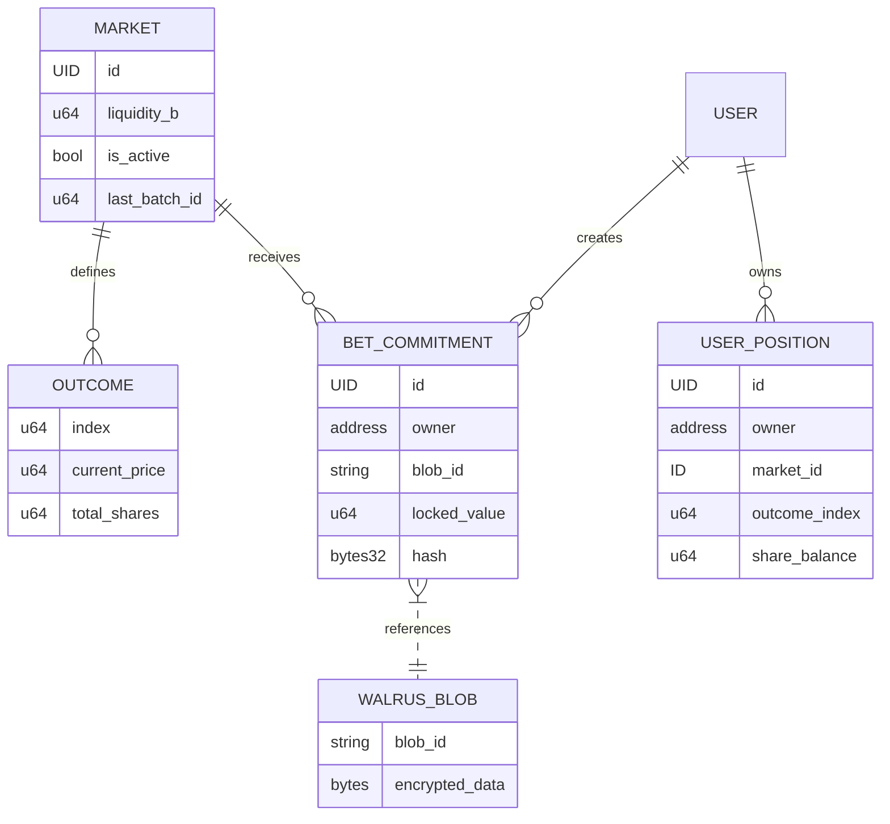

# Software Design Document (SDD): BanhMiCast
**Framework:** Sui Move (Object-Oriented) & Chainlink CRE (JavaScript/Serverless)  
**Author:** Principal Systems Engineer & Data Modeler Master

---

## 1. Data Model & Schema Definition

In a Move-based ecosystem, we treat data as first-class citizens (Objects). We decouple the **Market State** from the **User Intent** to allow for high-concurrency batching.

### 1.1 Sui On-chain Objects (Move Structs)

#### A. MarketObject (Shared Object)
The "World Table" source of truth.
```rust
struct MarketObject has key {
    id: UID,
    creator: address,
    description_cid: String,      // IPFS/Walrus link to metadata
    outcomes_count: u64,
    liquidity_b: u64,             // The 'b' parameter in LMSR (Sensitivity)
    shares_supply: Table<u64, u64>, // Outcome_Index -> Total_Shares_Issued
    current_prices: vector<u64>,  // Cached prices from the last batch
    is_active: bool,
    collateral_vault: Balance<SUI>,
    last_batch_id: u64,
}
```

#### B. BetCommitment (Owned Object)
Created when a user places a bet. It acts as an escrowed intent.
```rust
struct BetCommitment has key {
    id: UID,
    owner: address,
    market_id: ID,
    encrypted_payload_cid: String, // Pointer to Walrus Blob
    commitment_hash: vector<u8>,   // SHA3-256 of the plain text for verification
    collateral_locked: Balance<SUI>,
    epoch_locked: u64,
}
```

### 1.2 CRE JSON Interaction Schema
The communication bridge between the off-chain execution engine (CRE) and the Sui Move contract.

#### A. Input Payload (To CRE)
```json
{
  "market_id": "0xABC...123",
  "current_state": { "liquidity_b": 1000, "shares_supply": [5000, 3200, 4100] },
  "batch": [
    { "user": "0xUserA", "blob_id": "W-123", "commitment": "0xHASH1" },
    { "user": "0xUserB", "blob_id": "W-456", "commitment": "0xHASH2" }
  ]
}
```

#### B. Execution Result (From CRE to Sui)
```json
{
  "market_id": "0xABC...123",
  "batch_id": 99,
  "new_shares_supply": [5500, 3100, 4600],
  "price_updates": [0.45, 0.25, 0.30],
  "payout_adjustments": [
    { "user": "0xUserA", "shares_minted": 150, "outcome_index": 0 },
    { "user": "0xUserB", "shares_minted": 80, "outcome_index": 2 }
  ],
  "proof": "0xDON_SIG_HEX"
}
```

---

## 2. Module Decomposition

### 2.1 The "Truth Layer" (Sui Move Modules)
**Responsibility:** Finality, Escrow, and Cryptographic Verification.
*   **Asset Management:** Manages `collateral_vault`. Only releases funds if the CRE provides a valid, signed state update.
*   **Commitment Ledger:** Records user bets without knowing the contents. This ensures users cannot change their minds after seeing the price move.
*   **State Verifier:** Validates the `DON_SIG` against the known public keys of the Chainlink Oracle nodes.

### 2.2 The "Compute & Privacy Layer" (Chainlink CRE Script)
**Responsibility:** Data Retrieval, Decryption, and Heavy Math.
*   **Encrypted Decryptor:** Fetches payloads from Walrus. Internally decrypts using the DON's private key share (Threshold Encryption).
*   **LMSR Engine:** Calculates the cost function $C(q) = b \ln(\sum e^{q_i/b})$.
    *   Determines how many shares a user gets based on the spot price at the moment of batch execution.
    *   Maintains the "World Table" logic (Total probability sums to 1).
*   **Batch Aggregator:** Collates hundreds of individual bets into a single cryptographic proof to save 99% in gas fees.

---

## 3. Entity Relationship Diagram (ERD)



---

## 4. Technical Logic Flows

### 4.1 Off-chain Math: `executeBatch` (JavaScript)
```javascript
async function executeBatch(marketState, orders) {
    let b = marketState.liquidity_b;
    let q = [...marketState.shares_supply]; // current shares per outcome

    let adjustments = [];

    for (let order of orders) {
        let { outcomeIndex, investmentAmount } = decrypt(order.blob);
        
        // LMSR Math: Calculate delta_q
        // Cost(q + delta_q) - Cost(q) = investmentAmount
        let delta_q = solveLMSR(q, outcomeIndex, investmentAmount, b);
        
        q[outcomeIndex] += delta_q;
        adjustments.push({ user: order.user, minted: delta_q, index: outcomeIndex });
    }

    // New Prices: P_i = exp(q_i/b) / sum(exp(q_j/b))
    let newPrices = calculatePrices(q, b);

    return { q, newPrices, adjustments };
}
```

### 4.2 Security Boundary
1.  **Isolation:** The `decrypt()` function only operates within the CRE's protected memory. The Sui Validators never see the raw `outcomeIndex` until the batch is finalized.
2.  **Atomicity:** The `MarketObject` on Sui is only updated if all `BET_COMMITMENT` IDs in the batch match the hashes stored on-chain. If one hash is mismatched, the entire batch is rejected.

---
**Summary for Lead BA:** This design ensures that BanhMiCast remains **hyper-scalable** by moving the $O(n)$ math off-chain and **MEV-resistant** by keeping intents encrypted until they are batched.